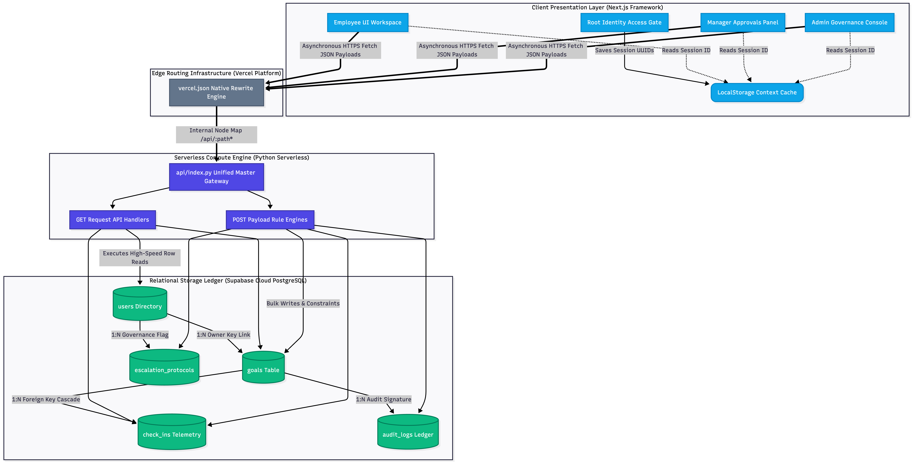

# 🌌 Nexus Tracker
### Next-Gen Multi-Role Goal Alignment, Telemetry & Compliance Audit Platform

> **AtomQuest Hackathon 1.0** · Built by [Gurdarshan Singh](https://github.com/GurdarshanSingh78)

[](https://nextjs.org)
[](https://supabase.com)
[](https://python.org)
[](https://vercel.com)

🔗 **Live Demo:** [atomquest-portal-smoky.vercel.app](https://atomquest-portal-smoky.vercel.app/)

---

## 💡 Overview

Traditional corporate performance systems suffer from visibility gaps, misaligned KPIs, and slow appraisal cycles. **Nexus Tracker** eliminates all of that — a serverless, cost-optimized platform unifying goal setting, progress tracking, and compliance management across Employees, Managers, and Admins in one seamless loop.

---

## 🧱 Architecture



---

## ⚙️ Tech Stack

| Layer | Technology |
|---|---|
| Frontend | Next.js (App Router) + Tailwind CSS |
| Backend API | Python 3 Serverless Micro-Gateway (`BaseHTTPRequestHandler`) |
| Database | Supabase · Cloud PostgreSQL via `postgrest-py` |
| Routing | Vercel Edge Platform + `vercel.json` Rewrite Engine |

---

## 👥 Demo Roles

Access all roles directly from the root Identity Gate — no login required.

| Role | UUID | Capabilities |
|---|---|---|
| Employee | `00000000-...-0001` | Build goals, submit quarterly check-ins |
| L1 Manager | `b26ab711-...-0000` | Inline edits, approvals, system lock |
| HR Admin | `c37bc832-...-0000` | Audit logs, analytics, CSV export |

---

## ✨ Features & Evaluation Checkpoints

### 🎯 Phase 1 — Goal Architecture
- **Smart Guardrails** — Backend blocks any sheet where total weightage ≠ `100%` or any goal drops below `10%`. Max `8` goals per employee.
- **Manager Override Console** — L1 Managers edit targets/weightage inline before authorizing.
- **Post-Auth Locks** — Once approved, employee parameters become immutable mid-cycle.
- **Shared KPI Broadcast** — Executives push goals org-wide; child clones lock Title & Target, only weightage is editable.

### 📊 Phase 2 — Telemetry & Scoring Engine
- **Quarterly Isolation** — Strict Q1–Q4 reporting windows.
- **Dynamic Score Formulas by UoM type:**
  - *Higher is Better →* `(Actual ÷ Target) × 100`
  - *Lower is Better →* `(Target ÷ Actual) × 100`
  - *Timeline / Zero-Incident →* Binary boundary evaluation

### 🔐 Bonus Modules
- **Immutable Audit Trail** — Every post-lock change logs actor identity, delta, and timestamp to `audit_logs`.
- **Escalation Engine** — Stalled approvals auto-escalate: Employee → Manager → HR via rule-based tier sweeps.
- **Analytics Dashboard** — Thrust area distributions, task completion rates, and active alert monitoring.
- **CSV Exporter** — One-click streaming of full performance data from Postgres to `.csv`.

---

## 🚀 Local Setup

```bash
git clone https://github.com/GurdarshanSingh78/nexus-tracker.git
cd nexus-tracker
npm install

# Configure environment
cp .env.example .env.local
# Set SUPABASE_URL and SUPABASE_KEY in .env.local

npm run dev
```

---

## 🧭 Evaluation Walkthrough

1. **Employee Node** → Create goals totaling `100%` weightage → Submit
2. **Manager Node** → Edit a target inline → Authorize & Lock
3. **Employee Node** → Open Phase 2 → Enter actuals → Verify score computation
4. **Admin Panel** → Check Audit Log → Download CSV report

---

*Built for AtomQuest Hackathon 1.0 · © 2024 Gurdarshan Singh*
